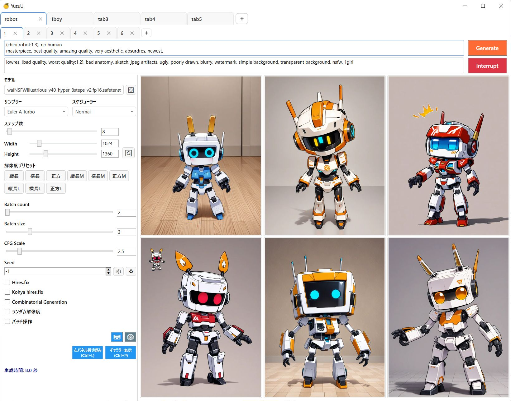

# YuzuUI

    

## スクリーンショット

    

## 概要

YuzuUIはStable Diffusion WebUIのAPIを利用したクライアントアプリです。WebUIの以下のような問題を解消するために作りました

- 全体的に動作が遅い
- 大量にタブを開くとメモリ消費量が爆発する
- ブラウザやPC再起動で作業中の設定が全て消える
- 複数タブの生成設定をまとめて修正したりするのが大変

自分のために作ったものを公開してるだけなので、足りない機能とかも色々あります

## インストール方法
[リリースページ](https://github.com/crstp/sd-yuzu-ui/releases)から最新のzipファイルをダウンロードして解凍してください。
インストーラーはありません。設定や画像DBは実行ファイルと同じディレクトリに作成されるので、専用ディレクトリに解凍して下さい。

## 使い方
- クライアントアプリなので、先にWebUIを起動しておく必要があります
- WebUIのAPI設定でAPIを有効にしておく必要があります
    - COMMANDLINE_ARGSに`--api`を追加することで有効にできます
    - [設定例](https://gist.github.com/crstp/2976412d94ce19145da4b8cbba11d250#file-webui-user-bat-L6)
    - WebUIのブラウザ自動起動は設定画面の"Automatically open webui in browser on startup"をDisableにすれば切れます
- WebUIの画像保存形式がwebpなのを前提に作ってあります。jpgやpngでも動く気はしますが、パフォーマンスが悪かったり上手く動かないかもしれません
- Ctrl+Tで最後に生成した設定で新しいタブを開くかCtrl+Rで現在のタブの設定を複製してタブを開くのが基本になります

## 機能

-   **タブデータの保存**
    -   タブデータは保存されるので、アプリを閉じても次回起動時に自動で復元されます
-   **二重タブ構造**:
    -   外側タブと内側タブの二重構造により、複数の画像生成設定を整理できます。外側タブがブラウザの別ウィンドウに相当し、内側タブがブラウザのタブに相当します
    -   タブの複製、外側タブのタイトル編集、ドラッグ＆ドロップによる並べ替えに対応しています。
    -   閉じたタブもブラウザのタブ復元機能のようにある程度まで復元可能です
-   **メモリ使用量の最適化** 
    -   タブをいくつ開いてもメモリ消費量はあまり変わらないようにしてあります。現在見ているタブの画像だけをロードしているので、他のタブにいくつ画像があってもほぼ影響がありません。
-   **自動補完**
    -   普通のDanbooruタグに加え、スペースを考慮しないマッチングもします。"from behind"は"frombehi"と書けばマッチします。タグにスペースが入っているか意識する必要がありません
    -   単語のイニシャルによるマッチができます。例えばarms behind backは"abb"でマッチできます。イニシャルによっては大量にヒットしますが、使用頻度ベースのソートがあるのでそれなりに使えます
-   **パネル折り畳み・ギャラリー表示**
    -   Ctrl+Lで左側パネルを折り畳んで、生成画像を大きく表示できます
    -   Ctrl+Pでアプリ画面全体に生成画像を表示するギャラリー表示に切り替えられます 
-   **自動フォーマッティング**
    -   Ctrl+Sを押すか生成を開始した時にプロンプトが自動でフォーマットされます。連続したカンマやスペースの過不足が自動で修正され、見た目がすっきりします
-   **バルクインポート**
    -   複数画像をドラッグアンドドロップすると、一意なプロンプトだけを抽出して新しいタブで開きます
-   **画像エクスポート**
    -   外側タブの下のタブに現在表示されている画像をまとめてフォルダへエクスポートします。外側タブを右クリックすると実行できます
    -   外側タブを閉じても後からエクスポートした画像をバルクインポートすればタブを復元できます
-   **バッチ操作**
    -   同じ外側タブ内の全ての内側タブの設定を一括で変更できます。プロンプトやStep数、解像度などが対象です
-   **ショートカットキー**
    -   アプリ左下にショートカットキーの一覧表示ボタンがあります
    -   全般
        -   **Ctrl/Shift + Enter**: 画像生成
    -   タブ関連
        -   **Ctrl + T**: 新しいタブを右側に開く(最後の生成設定を使用)
        -   **Ctrl + Shift + T**: 最後に閉じたタブを復元
        -   **Ctrl + R**: 現在の内側タブの設定を右側に複製
        -   **Ctrl + Shift + R**: 現在の内側タブの設定を左側に複製
        -   **Ctrl + W**: 現在の内側タブを閉じる
        -   **Ctrl + Tab / Alt + D**: 右のタブに移動
        -   **Ctrl + Shift + Tab / Alt + A**: 左のタブに移動
    -   エディタ
        -   **Ctrl + ↑↓**: プロンプト/LoRAの重み調整
        -   **Ctrl + -**: 重みに-1を掛ける(Negpip用)
        -   **Ctrl + D**: 現在のカーソル位置のタグを削除
        -   **Ctrl + F**: 検索パネルを表示
        -   **Esc**: 検索パネルを非表示

## 注意点
-   作者が使いやすいと思う挙動に最適化されています
-   txt2img専用です。img2imgはUIがごちゃごちゃするのとあまり使わないのでサポートは未定です

## 拡張機能について
-   サーバー側に設定が保存されて、生成時にはパラメーターを渡す必要がない拡張機能(Dynamic promptsの基本的なタグ展開、Negpipなど)は動作します
-   クライアント側から生成時に設定を送る必要がある拡張機能は動作しませんが、以下のものはサポートしています
    - Dynamic promptsのCombinatorial Generation
    - ForgeのKohya hires.fix integrated
    - ForgeのRandom Resolution
-   動作しない拡張機能の例
    - Adetailer
    - controlnet
    - regional-prompter 

## ビルド方法
- 最新のVisual Studio 2022でビルドできます
- 配布バイナリは単体で実行できるように.NETのライブラリ入りの実行ファイルにしているのでサイズが巨大になっています

## ライセンス
LICENSEを参照して下さい。フィッシングやマルウェアが流行しているので実行ファイル再配布は禁止してあります。このGithubページ以外で配布していません

## 既知の問題
- 実装の問題で外側タブを何度も移動するとメモリ使用量が増えます。再起動で直ります
- 稀にテキストボックスのカーソルが飛ぶ。再現できたら直します
