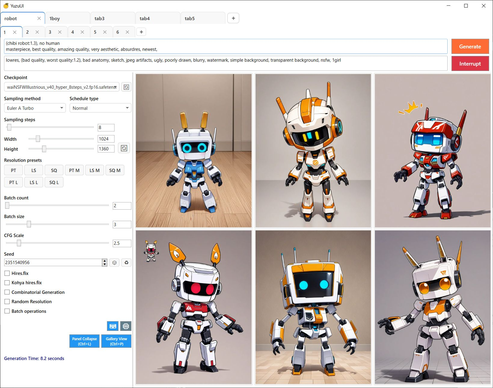

# YuzuUI

    

# 日本語版はこちら: [README-JP.md](README-JP.md)

## Screenshot

    

## Overview

YuzuUI is a desktop client for Stable Diffusion WebUI. I built it to fix some of the pain points I ran into with the default browser UI:

- Runs slowly overall
- Memory usage skyrockets when you open lots of tabs
- All your settings disappear if the browser or PC restarts
- Tweaking the same setting across many tabs is tedious

I'm open-sourcing because I already built it, but expect a few missing features here and there.

## Installation
Download the latest zip file from the [Releases page](https://github.com/crstp/sd-yuzu-ui/releases). There is no installer. But it will create settings and image db under the current directory, so extract it to a separate directory.

## Getting Started

1. Start Stable Diffusion WebUI first — YuzuUI is just a frontend and requires WebUI backend.
2. Enable the API in WebUI by adding `--api` to `COMMANDLINE_ARGS`.
   - [Example config](https://gist.github.com/crstp/2976412d94ce19145da4b8cbba11d250#file-webui-user-bat-L6)
   - You can stop the browser from auto-launching via the WebUI setting "Automatically open webui in browser on startup".
3. The app assumes images are saved as `.webp`. JPG or PNG might work but could be slower or break things.

## Features

- **Restoring tabs**
  - Your tabs are saved on exit and restored at launch.
- **Dual-layer tab design**
  - Outer tabs act like browser windows; inner tabs are like browser tabs.
  - Duplicate tabs, rename outer tabs, and drag-drop to reorder. Closed tabs can be recovered, browser-style.
- **Memory-friendly**
  - Only the images in the tab you're viewing are loaded, so memory stays flat no matter how many tabs you have.
- **Auto-completion**
  - Works with standard Danbooru tags plus extras:
    - Ignores spaces, so "from behind" matches "frombehi".
    - Initials match: "arms behind back" → "abb". You may get lots of hits, but they're sorted by usage frequency.
- **Panel collapse & gallery view**
  - `Ctrl + L` toggles the left panel.
  - `Ctrl + P` switches to a full-screen gallery.
- **Auto formatting**
  - Press `Ctrl + S` or start a generation and your prompt is cleaned up (extra commas/spaces, etc.).
- **Bulk import**
  - Drag-drop multiple images and YuzuUI extracts the unique prompts into fresh tabs.
- **Image export**
  - Export all images in the current outer tab to a folder (right-click the outer tab).
  - You can bulk-import those images later to restore the tab.
- **Batch edit**
  - Change prompt, steps, resolution, etc. across every inner tab in an outer tab.
- **Shortcuts**
  - A full list lives in the bottom-left corner of the app.

  **General**
  - **Ctrl / Shift + Enter**: Generate images

  **Tabs**
  - **Ctrl + T**: Open a new tab on the right (reuse last settings)
  - **Ctrl + Shift + T**: Reopen last closed tab
  - **Ctrl + R**: Duplicate current tab to the right
  - **Ctrl + Shift + R**: Duplicate current tab to the left
  - **Ctrl + W**: Close current tab
  - **Ctrl + Tab / Alt + D**: Next tab
  - **Ctrl + Shift + Tab / Alt + A**: Previous tab

  **Editor**
  - **Ctrl + ↑ / ↓**: Adjust weight for prompt / LoRA
  - **Ctrl + -**: Multiply weight by -1 (for Negpip)
  - **Ctrl + D**: Delete tag under cursor
  - **Ctrl + F**: Open search panel
  - **Esc**: Close search panel

## Notes

- Tuned for the behavior I find convenient.
- txt2img only. img2img is TBD because I rarely use it and the UI gets messy.

## Extensions

- Extensions that store settings on the server side (e.g., basic Dynamic Prompts tag expansion, Negpip) work fine.
- Extensions that need parameters sent from the client usually don't work, but these are supported:
  - Dynamic Prompts — Combinatorial Generation
  - Forge — Kohya hires.fix integrated
  - Forge — Random Resolution

  Known non-working examples:
  - Adetailer
  - ControlNet
  - Regional Prompter

## Building

- Open with the latest Visual Studio 2022 and build.
- The release binaries include all .NET libraries, so the file is quite large.

## License

See LICENSE. To curb phishing/malware, re-distributing the binaries is forbidden. This project is only distributed from this GitHub page.

## Known Issues

- Moving an outer tab many times leaks memory (restart fixes it).
- Occasionally, the caret jumps in the textbox — will fix once it becomes reproducible. 